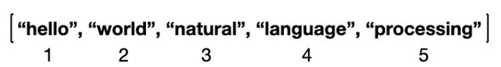
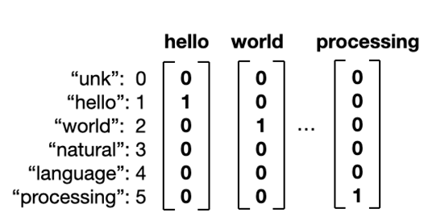

# week 1
단어들의 명단 – vocabulary

이 숫자를 우리는 index 또는 id라고 부른다. 마치 반 아이들에게 번호를 주는 것처럼요. 선생님께서, "오늘 4월 3일이네, 칠판 지울 사람 3번 누구니?", "네~ natural입니다" 이런 것.

### vector로 표현
Column vector는 Nx1 matrix로, 앞으로 자주 등장
index를 어떻게 column vector로 표현할 수 있을까? 간단하게 해당하는 id 번째 열을 1로 채우고, 나머지는 0으로 채우면 된다.

여기서 index 0에 등장하는 unk는 모르는 단어 (unknown)를 뜻한다. 나중에 새로운 단어를 보았을 때 모른다는 표시를 하기 위함
이렇게 모든 단어를 vector로 표현하는 것을 one-hot vector라고 한다. 모든 열 중에 단 한 개의 숫자만 1이고, 나머지는 0으로 표현되기에 이러한 이름으로 불린다.

### 자주 쓰이는 단어만 알고 싶다 ~ word frequency를 이용한 vocabulary 구성

대부분의 NLP task는 아는 단어를 모아 vocabulary를 구성하는 것부터 시작한다. 먼저 가지고 있는 데이터를 전부 끌어모아야 한다. NLP에서 이 데이터를 corpus라고 부름.

먼저 corpus 안에 있는 전부 모아 단어를 센다. corpus가 크면 클수록 구별되는 단어의 개수가 늘어나겠죠
